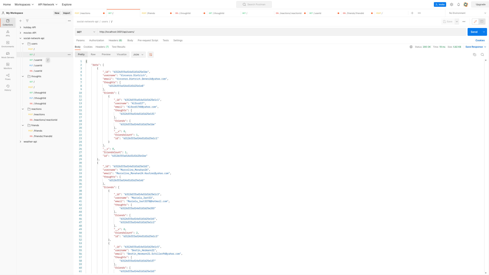

# social-network-api 

## Table of Contents

- [Description](#description)
- [Deployed Link](#deployed-link)
- [Github Repository Link](#github-repository-link)
- [Video Walkthrough Link](#video-walkthrough-link)
- [Screenshot](#screenshot)
- [Installation](#installation)
- [Usage](#usage)
- [Contributing](#contributing)
- [Tests](#tests)
- [Questions](#questions)

## Description

A social network API web application where users can share their thoughts, react to friends’ thoughts, and create a friend list.

## Deployed Link

N/A

## Github Repository Link

https://github.com/ss12932/social-network-api

## Video Walkthrough Link

Due to screencastify's 5 min limit on recording videos, the video walkthroughs have been split into several parts:

- [Part 1 Video Walkthrough](https://drive.google.com/file/d/1XDHuJM_5--Nfi5Ul5WXzmixKTdyccGv9/view)
- [Part 2 Video Walkthrough](https://drive.google.com/file/d/1r5WHfn_0S7xW-tx0mFEdS9yt-49UO18o/view)
- [Part 3 Video Walkthrough](https://drive.google.com/file/d/1RUYpLiXnG9BtLLiJB3nF1ij7HBm0_Tvt/view)
- [Part 4 Video Walkthrough](https://drive.google.com/file/d/1gGJL4ZaKL3h8COiy1RdjxZsxdn8Uuz7c/view)

## Screenshot

## Installation

Please follow the instructions below:

Before installation of this application, please ensure you have the mongoDB database (community edition) installed on your local machine. If you don't have it, please refer to the documentation on the official mongoDB website:

https://www.mongodb.com/try/download/community

Please visit the github repository link mentioned above or click [here](https://github.com/ss12932/social-network-api). Click on the green code button and select your preferred method of git cloning the application to your local machine by copying the link. This requires the use of your command line terminal, navigate to your local directory of choice and perform a git clone of this application. eg. for the https method, `git clone https://github.com/ss12932/social-network-api.git`,

Afterwards, navigate to the application you just cloned:

`cd social-network-api`

and do a

`code .`

to open it in your VS code. Once opened in yout VS code IDE, do a

`npm install` or `npm i`

to install all dependencies required to run this application.

## Usage

Please follow the instructions below:

To initiate this application in your integrated terminal, please run:

`npm run start`.

This will start the application and also `npm run seed` to seed the dummy data provided by the faker js package.

## License

This Project is licensed under the MIT License, for more information please visit: [License](https://choosealicense.com/licenses/mit/)

## Contributing

None

## Tests

Please follow the instructions below:

None

## Questions

Please contact me on my email: ss12932@my.bristol.ac.uk
